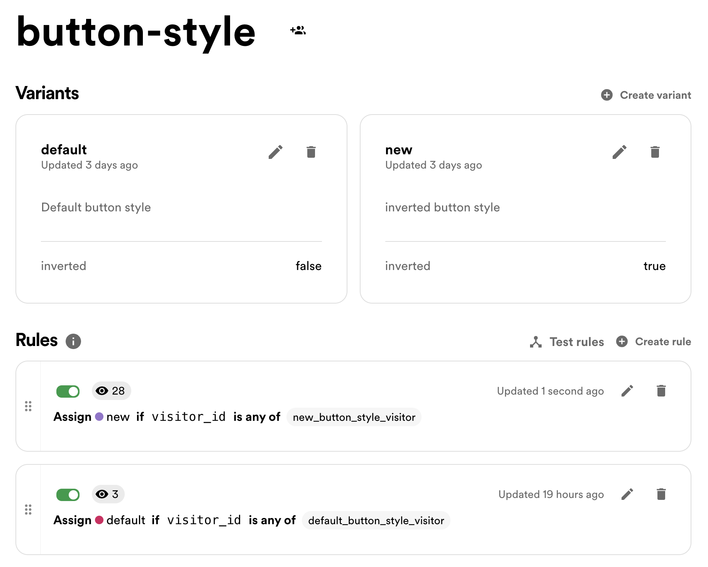
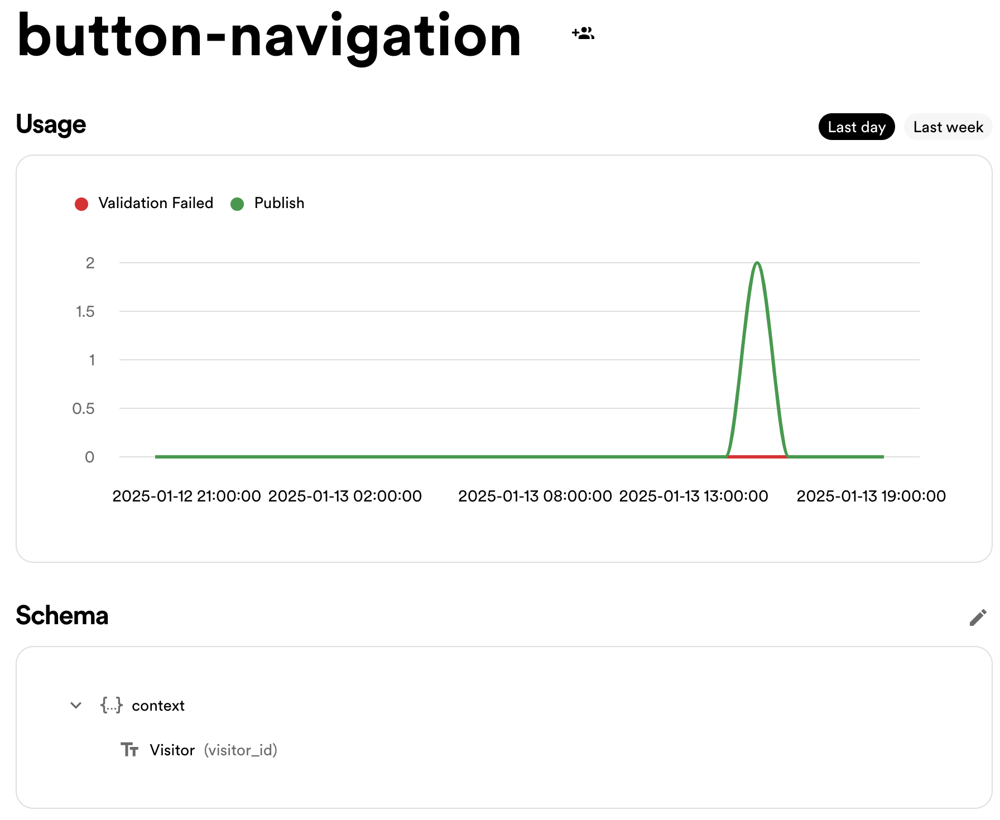
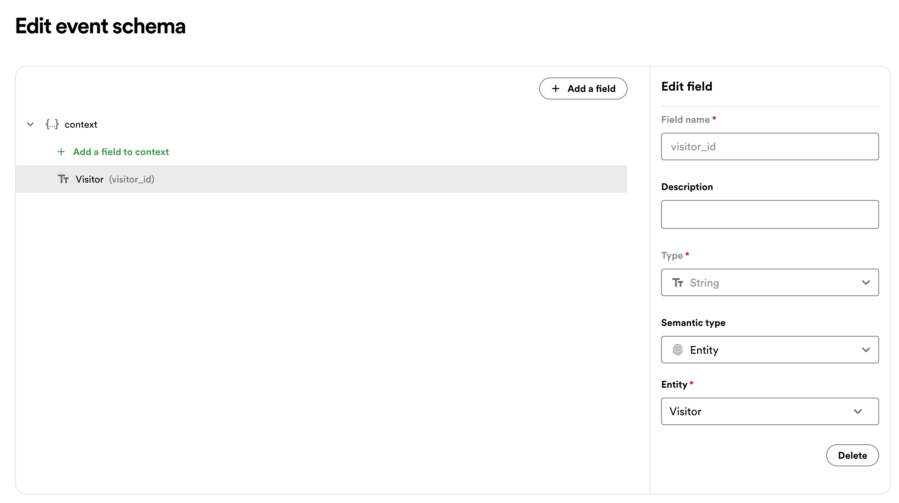

# About this Example

This example is an end-to-end walkthrough of how to set up a
simple next.js App that uses Confidence to experiment on what
button style you should use for your website. It will show you
how to set things up in Confidence as well as setting up your
website so you can eventually start to experimenting on it.

The intention is that you should be able to just use this readme
to set everything up. Of course you can always just go ahead and
clone this repo and only focus on prepping your Confidence for
it.

## Install the stuff you need

1. **npx create-next-app@latest** (Just do the recommended choices).
2. `yarn add @spotify-confidence/sdk`
3. `yarn add @spotify-confidence/react`

## Prepare Confidence

In order for this example to work we need to make some prep work
on the confidence side. In particular we need to

- Create the **[flag](https://app.confidence.spotify.com/flags)** button-style and the **override rules** (new_button_style_visitor and default_button_style_visitor) for that

  

- Create the **[event](https://app.confidence.spotify.com/events/)** button-navigation we will track.

  

  Make sure to also add the visitor_id as a type Entity to the context in your schema

  

- Setup the **[client](https://app.confidence.spotify.com/admin/clients)** we will use to interact with Confidence from our app. You wil likely already have a default client that you can use

## Setup of Confidence

Once we have everything up and running on the Confidence side we can
go ahead and integrate it to our website. The idea with this example
is to test a new button layout (inverted) on the frontpage. We will use
our override rules to make sure that we get the flag value we expect.

The first thing we need to do is to connect your website with Confidence. Since
the confidence provider relies on some client only features we need
to make sure to always use _'use client'_ whenever we use the provider.Thus we need
to make sure to make sure that our entire App is wrapped around it
if we want to set some things like our visitor_id in the global context.

The simplest way of doing that is to creat a component that you
will wrap your entire application in like so (see rootconfprovider.tsx):

```javascript
'use client';

import { ConfidenceProvider } from '@spotify-confidence/react';
import { ReactNode } from 'react';
import { Confidence, visitorIdentity } from '@spotify-confidence/sdk';

if (!process.env.NEXT_PUBLIC_REACT_APP_CLIENT_SECRET) {
  console.error('NEXT_PUBLIC_REACT_APP_CLIENT_SECRET not set in .env');
  process.exit(1);
}

const cf = Confidence.create({
  clientSecret: process.env.NEXT_PUBLIC_REACT_APP_CLIENT_SECRET,
  environment: 'client',
  region: 'eu',
  timeout: 1000,
  logger: console,
});

cf.track(visitorIdentity());
cf.setContext({ visitor_id: 'new_button_style_visitor' });
//cf.setContext({visitor_id: 'default_button_style_visitor'})
//cf.setContext({ visitor_id: visitorIdentity().toString() })

type RootConfProviderProps = {
  children: ReactNode,
};

export default function RootConfProvider({ children }: RootConfProviderProps) {
  return <ConfidenceProvider confidence={cf}>{children}</ConfidenceProvider>;
}
```

Next you should locate `layout.tsx` and make sure our App uses the
RootConfProvider we just created:

```typescript jsx
import RootConfProvider from '@/app/rootconfprovider';

export default function RootLayout({
  children,
}: Readonly<{
  children: React.ReactNode;
}>) {
  return (
    <html lang="en">
      <body className={`${geistSans.variable} ${geistMono.variable} antialiased`}>
        <RootConfProvider>{children}</RootConfProvider>
      </body>
    </html>
  );
}
```

Doing it this way will allow you to use server compiled pages that does not
require client only features, e.g. needs the _use client_ directive.

### Using our Confidence Flag

The final step is of course to use the flag that we created before.
For this we will first create our own special button that will record
an event in Confidence if it is clicked. It will also change layout depending
on if it should be inverted or not:

```typescript jsx
'use client';

import { useConfidence } from '@spotify-confidence/react';
import { useRouter } from 'next/navigation';
import { ReactNode } from 'react';

export type MTButtonProps = {
  inverted?: boolean;
  onClick?: () => void;
  children: ReactNode;
  href?: string;
  trackEvent?: string;
};

export function ConfidenceButton(props: MTButtonProps) {
  const invertedCN =
    'rounded-full border border-solid border-transparent transition-colors flex items-center justify-center bg-foreground text-background gap-2 hover:bg-[#383838] dark:hover:bg-[#ccc] text-sm sm:text-base h-10 sm:h-12 px-4 sm:px-5';
  const nonInvertedCN =
    'rounded-full border border-solid border-black/[.08] dark:border-white/[.145] transition-colors flex items-center justify-center hover:bg-[#f2f2f2] dark:hover:bg-[#1a1a1a] hover:border-transparent text-sm sm:text-base h-10 sm:h-12 px-4 sm:px-5 sm:min-w-44';

  const confidence = useConfidence();
  const router = useRouter();

  const cn = props.inverted ? invertedCN : nonInvertedCN;

  function onClick() {
    if (props.trackEvent) {
      confidence.track(props.trackEvent);
    }
    if (props.href) {
      router.push(props.href);
    }
  }

  return (
    <button className={cn} onClick={onClick}>
      {props.children}
    </button>
  );
}
```

Observe that this button also need the _use client_ directive as it
uses the confidence provider to track events.

Additionally we will create _Flags.tsx_ file where we will store the definitions of our flags
(currently just one) as well as a utility function to print flag data if we like

```typescript jsx
'use client';
import { useConfidence } from '@spotify-confidence/react';

export type ButtonStyleFlag = {
  inverted: boolean;
};

export function Flags() {
  const confidence = useConfidence();
  const flagData = JSON.stringify(confidence.useEvaluateFlag('button-style', { inverted: false }), null, '  ');
  // const flagData = useDeferredValue(confidence.useFlag('web-sdk-e2e-flag.str', 'default'));
  return (
    <fieldset>
      <legend>Flags</legend>
      <pre>{flagData}</pre>
    </fieldset>
  );
}
```

The final step is use our newly created button in our App. We will add it to our
it to our root page like so:

```typescript jsx
'use client';

import Image from 'next/image';
import { ConfidenceButton } from '@/components/ConfidenceButton';
import { useConfidence } from '@spotify-confidence/react';
import { ButtonStyleFlag } from '@/components/Flags';

export default function Home() {
  const confidence = useConfidence();
  const buttonStyle: ButtonStyleFlag = confidence.useFlag('button-style', { inverted: false });

  return (
    <div className="grid grid-rows-[20px_1fr_20px] items-center justify-items-center min-h-screen p-8 pb-20 gap-16 sm:p-20 font-[family-name:var(--font-geist-sans)]">
      <main className="flex flex-col gap-8 row-start-2 items-center sm:items-start">
        <h1 className={'w-max text-2xl font-bold'}>Confidence on Next.js</h1>
        <div className="flex gap-4 items-center flex-col sm:flex-row">
          <ConfidenceButton inverted={buttonStyle.inverted} trackEvent={'button-navigation'} href={'/page1'}>
            Button Style
          </ConfidenceButton>
        </div>
      </main>
      <footer className="row-start-3 flex gap-6 flex-wrap items-center justify-center">
        <a
          className="flex items-center gap-2 hover:underline hover:underline-offset-4"
          href="https://confidence.spotify.com/docs"
          target="_blank"
          rel="noopener noreferrer"
        >
          <Image aria-hidden src="/file.svg" alt="File icon" width={16} height={16} />
          Read the Confidence Docs
        </a>
        <a
          className="flex items-center gap-2 hover:underline hover:underline-offset-4"
          href="https://github.com/spotify/confidence-sdk-js/tree/main/examples"
          target="_blank"
          rel="noopener noreferrer"
        >
          <Image aria-hidden src="/window.svg" alt="Window icon" width={16} height={16} />
          More JS Examples
        </a>
        <a
          className="flex items-center gap-2 hover:underline hover:underline-offset-4"
          href="https://confidence.spotify.com/"
          target="_blank"
          rel="noopener noreferrer"
        >
          <Image aria-hidden src="/globe.svg" alt="Globe icon" width={16} height={16} />
          Go to your Confidence Space
        </a>
      </footer>
    </div>
  );
}
```

Again observe the need for the _use client_ directive as we are resolving the flag to
inform what style our button should have

## Test your application

Before you start your application dont forget to add your _.env_ file with the client secret

```
NEXT_PUBLIC_REACT_APP_CLIENT_SECRET=your_client_secret
```

Once that is done you can go ahead and run

```bash
yarn dev
```
